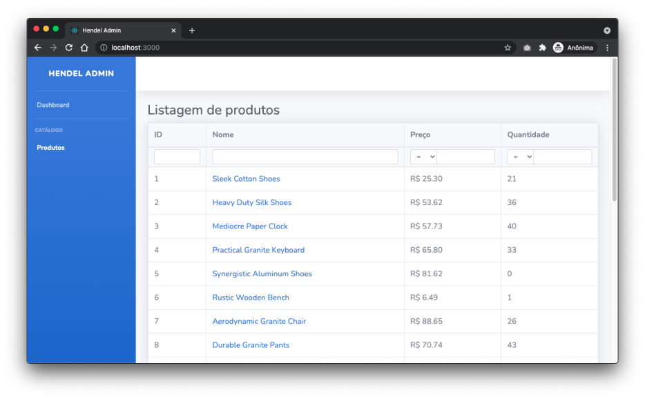

# Mini Projeto Vaga FrontEnd ReactJS

O objetivo deste mini projeto é implementar tarefas adicionais ao admin em react deste repositório, que consiste em gerenciar o catálogo de produtos de um e-commerce.



### Tarefas:
1. Adicionar paginação a listagem de produtos (manter a paginação após reload da página)
2. Permitir filtra a listagem de produtos com base nos campos de busca disponíveis
3. Exibir todas as informações do produto na página de Detalhes do produto
4. Exibir um "loading" no carregamento das páginas
5. Permitir adicionar e remover Produtos relacionados na página de detalhes do produto
6. Previnir requisições duplicadas ao adicionar ou remover um produto relacionado. Ex: O usuário clica de enviar um formulário e antes da requisição terminar ele clica novamente.

### Rodando o projeto

```bash
git clone git@github.com:Hendel-Tecnologia/teste-vaga-reactjs.git
```

```bash
cd teste-vaga-reactjs
```

```bash
yarn
```

```bash
yarn start
```

__OBS: Após finalizado o teste, o candidato deverá subir o projeto em seu github e nos enviar o link__

## API Documentation
- Product
  - [list](#list-products)
  - [get details](#get-product-details)
  - [create](#create-a-product)
  - [update](#update-a-product)
  - [delete](#delete-a-product)
  - [add related product](#add-related-product)
  - [remove related product](#remove-related-product)

### List Products
```
GET /products
```

```json
// response body, status: 200
{
  "current_page": 1,
  "prev_page": null,
  "next_page": 2,
  "page_size": 20,
  "total_pages": 25,
  "total_row_count": 500,
  "data": [
    {
      "id": 1,
      "name": "Sleek Cotton Shoes",
      "description": "A ab est.Quis rem quia.Totam recusandae rem.",
      "price": "25.3",
      "quantity": 21,
      "created_at": "2021-07-07T04:24:25.286Z",
      "updated_at": "2021-07-07T04:24:25.286Z"
    }
  ]
}
```

#### Search Matchers

List of all possible predicates

| Predicate | Description | Notes |
| ------------- | ------------- |-------- |
| `*_eq`  | equal  | |
| `*_not_eq` | not equal | |
| `*_cont` | Contains value | uses `LIKE` |
| `*_cont_any` | Contains any of | |
| `*_cont_all` | Contains all of | |
| `*_lt` | less than | |
| `*_lteq` | less than or equal | |
| `*_gt` | greater than | |
| `*_gteq` | greater than or equal | |

Example: `GET /products?q[quantity_eq]=0`

#### Pagination

The following parameters are used for paging:
  - `page` (default 20)
  - `page_size` (default 1)

Example: `GET /products?page=2&page_size=5`

### Get Product details
```
GET /products/:id
```

```json
// response body, status: 200
{
  "id": 1,
  "name": "Product test",
  "description": "Description of product test",
  "price": "10.99",
  "quantity": 50,
  "created_at": "2021-07-05T23:13:17.383Z",
  "created_at": "2021-07-05T23:13:17.383Z",
  "related_products": [
    {
      "id": 2,
      "name": "Product test 2",
      "price": "10.99",
      "main_product_id": 1
    },
    {
      "id": 3,
      "name": "Product test 3",
      "price": "10.99",
      "main_product_id": 1
    }
  ]
}
```

```json
// response body, status: 404
{
  "errors": ["Couldn't find Product with 'id'=22"]
}
```

### Create a Product
```
POST /products
```

```json
// request body
{
  "name": "Product test",
  "description": "Description of product test",
  "price": "10.99",
  "quantity": 50,
}
```

```json
// response body, status: 201
{
  "id": 1,
  "name": "Product test",
  "description": "Description of product test",
  "price": "10.99",
  "quantity": 50,
  "created_at": "2021-07-05T23:13:17.383Z",
  "created_at": "2021-07-05T23:13:17.383Z"
}
```

```json
// response body, status: 422
{
  "errors": ["Name has already been taken"]
}
```

### Update a Product
```
PUT/PATCH /products
```

```json
// request body
{
  "description": "NEW Description of product test",
}
```

```json
// response body, status: 201
{
  "id": 1,
  "name": "Product test",
  "description": "NEW Description of product test",
  "price": "10.99",
  "quantity": 50,
  "created_at": "2021-07-05T23:13:17.383Z",
  "created_at": "2021-07-05T23:13:17.383Z"
}
```

```json
// response body, status: 422
{
  "errors": ["Description can't be blank"]
}
```

### Delete a Product

```
DELETE /products/:id
```

```json
// response body, status: 204
null
```

```json
// response body, status: 404
{
  "errors": ["Couldn't find Product with 'id'=22"]
}
```

### Add Related Product
```
POST /products/:product_id/related_products
```

```json
// request body
{
  "related_product_id": 22
}
```

```json
// response body, status: 201
{
  "id": 22,
  "name": "Product test",
  "price": "10.99",
  "main_product_id": 1
}
```

```json
// response body, status: 404|422
{
  "errors": ["Mensagem de erro"]
}
```

### Remove Related Product

```
DELETE /products/:product_id/related_products/:related_product_id
```

```json
// response body, status: 204
null
```

```json
// response body, status: 404
{
  "errors": ["Mensagem de erro"]
}
```
